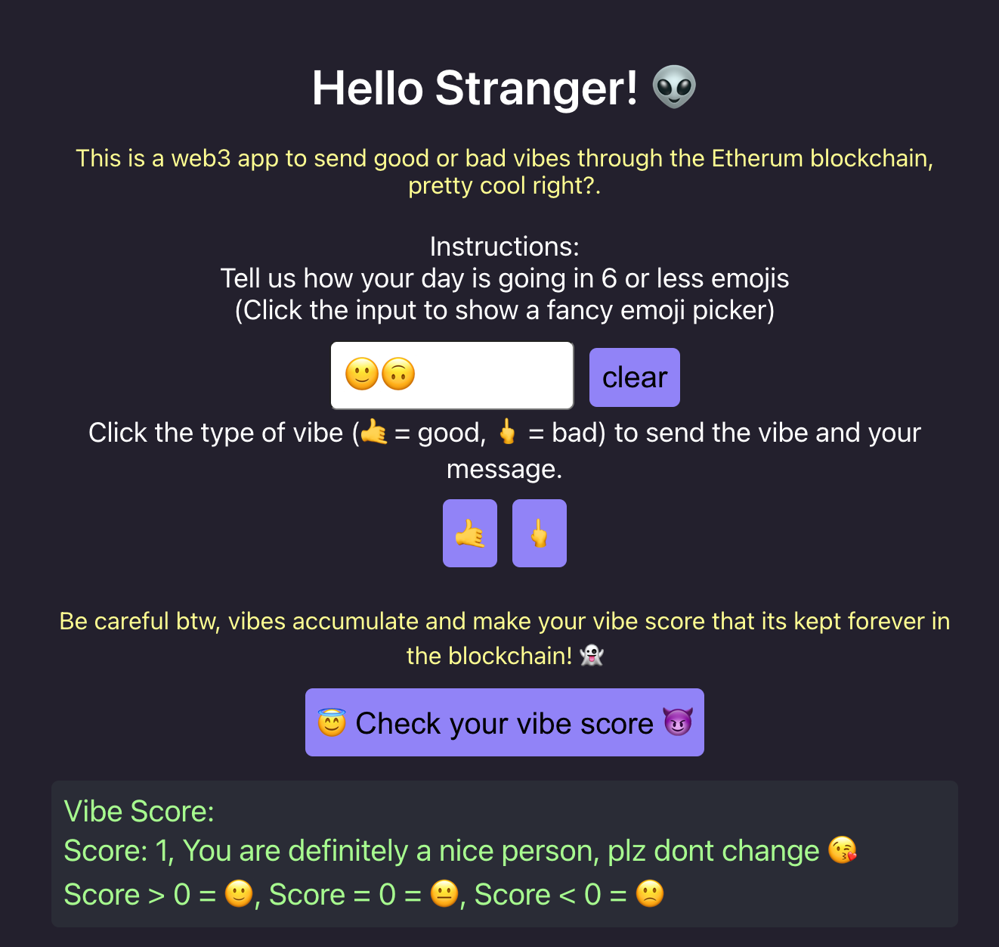

# Vibe Sender - Web3 App

Web3 App for sending good/bad vibes.



## Play 👽

This Web3 app interacts with an Etherum/Solidity contract.

A working web3 app interacting with this contract can be found on: https://vibe-sender.wichon.repl.co/

Code for the deployed Etherum/Solidity contract implementation this Web3 app interacts with can be found on: [vibe-sender-web3-smart-contract](https://github.com/wichon/vibe-sender-web3-smart-contract)

## 1. Setup

### 1.1 Load this code on Repl.it

- Hit run
- Edit [App.jsx](#src/App.jsx) and watch it live update!

By default, Replit runs the `dev` script, but you can configure it by changing the `run` field in the `.replit` file.

### 1.2 Setup a Metamask wallet using Rinkeby as the testnet.

Got to [Metamask](https://metamask.io/) and setup your wallet 🦊

## 2. Customize

### 2.1 Interacting with your own contract

Modify App.js, especifically:

```
CONTRACT_ADDRESS = 'YOUR_OWN_CONTRACT_ADDRESS'
```

Go to your repl.it website and start minting NFTs

### 2.2 Connect your Metamask 🦊 wallet with your site

### 2.3 Get some fake ETH to fund your wallet

https://faucets.chain.link/rinkeby

## 3. Have fun and tweak your Web App to your liking 🛸!